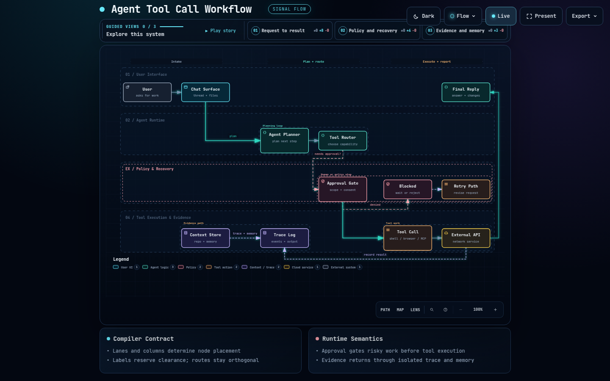
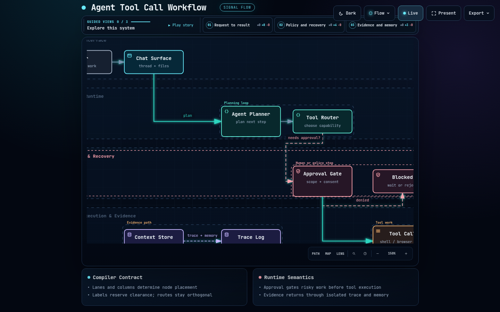

# Pointer-anchored wheel zoom visual evidence

Captures produced from revision `b9410d4` with Node 22.23.2 and headless
Chromium 131, using the commands below. Automated browser evidence, perceptual
review and the untested remainder are reported separately.

## Automated browser evidence

- Commands: `cd archify && ARCHIFY_CHROME=<chrome> node --test
  test/wheel-zoom.test.mjs`, `npm test`, and `ARCHIFY_CHROME=<chrome>
  npm run test:browser` at code revision `4e25478`; the captures below come from
  `node bin/archify.mjs render workflow examples/agent-tool-call.workflow.json
  <out> --quality showcase` driven by the same headless Chromium.
- Results at `4e25478`: wheel-zoom suite 3/3 pass; `npm test` 1653 tests with
  0 fail (1588 pass, 65 skipped browser suites); the shared browser gate
  226/226 pass, 0 skipped.
- Input: trusted Chrome `Input.dispatchMouseEvent` mouse-wheel events
  (`isTrusted`), never synthetic `dispatchEvent` calls.
- Matrix: eight combinations of preset (signal-flow, classic) x theme (dark,
  light) x viewport (1440x900, 1440x700). Every combination moves 1x to 1.5x
  toward the pointer, the percent control reads 150%, and the gesture is
  consumed (`defaultPrevented` true). With `?embed=1` the same wheel leaves the
  camera at 1x with `defaultPrevented` false.
- Pointer-anchor pixel check: the pre-zoom crop around the pointer is re-rendered
  at 1.5x by the browser (`Page.captureScreenshot` with `clip.scale`) and compared
  with the post-zoom capture of the same screen region. Mean channel delta is
  1.0-2.5 of 255, with at most 2.5% of pixels above 24. The same comparison
  against a deliberately center-anchored reference gives 21.6-22.9 mean and
  15.6-20.6% above 24, so the check separates the anchored result from a wrong
  anchor rather than passing everything.
- Conditions: 1440x900 or 1440x700 desktop viewport, `showcase` quality, dark or
  light theme, `data-motion="still"`, page at scrollY 0, pointer at 34% width and
  31% height of the diagram stage, one `-120` wheel event.

## Perceptual visual review

Status: **passed** by the author at revision `b9410d4` (2026-09-17). The author
inspected the two captures below and reported no visible defect, with the diagram
correctly magnified about the pointer. Recorded alongside that review: the
magnified diagram is clipped at the stage boundary, the cards below the diagram
and the navigation overlays stay in place, and the percent control reads 150%.

## Captures

- Before: `1x`, full signal-flow workflow diagram
  (`agent-tool-call.workflow.json`).
- After: one `-120` mouse-wheel event at the pointer, `1.5x`.
- The content under the pointer is preserved in the viewport; the surrounding
  diagram expands around that anchor instead of zooming from the SVG center.

## Not tested

- Physical trackpad and two-finger scrolling, momentum, pinch gestures and
  OS-level scroll or acceleration settings: the wheel input is headless Chrome's
  trusted CDP input, not a device session, so no trackpad timing, inertia or
  platform gesture behavior is claimed.
- Other browsers, OS hosts, display scaling, touch devices, and installed-package
  hosts were not exercised. Device and trial-use acceptance is a separate claim
  from these browser checks; see
  [Contributing](../../CONTRIBUTING.md#choose-evidence-by-impact).

The generated HTML is not checked in because the public renderer tests already
cover it and the full viewer runtime would be duplicated here.
